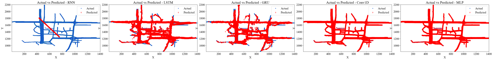
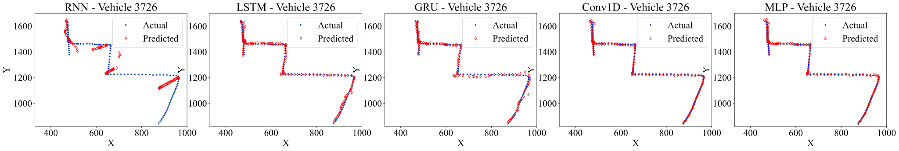
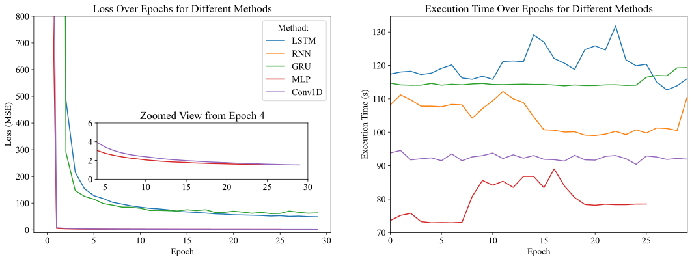
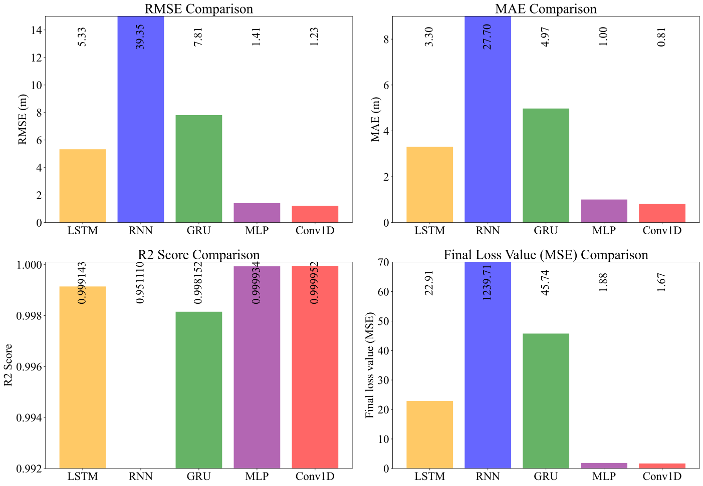

# **Comparative Analysis of Neural Network-Based Techniques for Vehicular Location Prediction**

This repository presents reproducible Python code to predict temporal vehicular locations in the ['Vehicular Mobility Trace at Seoul, South Korea' dataset](https://ieee-dataport.org/open-access/vehicular-mobility-trace-seoul-south-korea). The dataset is generated using SUMO. Please refer to the [dataset](https://ieee-dataport.org/open-access/vehicular-mobility-trace-seoul-south-korea) and the [relevant paper](https://ieeexplore.ieee.org/document/9234515/) for more information about the data. Moreover, you can refer to Section III in the report file ('Report/_2024-08-07 - ANN - 7088CEM Project Report.pdf_'.

---

## _Abstract_

Vehicular location prediction is crucial for improving Quality of Service (QoS) in fifth-generation (5G) radio Resource Allocation (RA). This study presents a novel comparison of five Neural Network (NN) models—Recurrent NN (RNN), Long Short-Term Memory (LSTM), Gated Recurrent Unit (GRU), one-dimensional convolutional NN (Conv1D), and Multi-Layer Perceptron (MLP)—in predicting vehicle positions using a dataset of vehicular mobility traces from Seoul, South Korea. The models are assessed using metrics such as coefficient of determination (R2 score), Root Mean Square Error (RMSE), loss over epochs, and execution time per epoch. Out of the models tested, the MLP model showed the best performance, with an RMSE of 0.42 meters and an R2 score of 0.999992. This represents a 32% decrease in RMSE compared to Conv1D and the recurrent models and a significantly higher R2 score. Moreover, MLP demonstrated the most rapid convergence and the shortest average execution time per epoch, emphasizing its efficiency. The results suggest that using simpler architectures, such as MLP, is quicker and more effective for this particular task. This provides valuable information for designing proactive RA strategies in 5G networks.

Please refer to the '*Report*' folder for the complete academic report.

---

## *Code Overview:*

Reproducing the code is easy. There are 3 main steps in our methodology. We named our Jupyter notebooks after these steps:

- _1-preprocessing.ipynb_
- _2-Tuning_ANN_Location_Prediction.ipynb_
- _3-Evaluation_of_Methods_Location_Prediction.ipynb_

You can follow them step by step for reproduction.

### **Preprocessing (_1-preprocessing.ipynb_):**

If you have access to download IEEE DataPort datasets, you can download the ['Vehicular Mobility Trace at Seoul, South Korea' dataset](https://ieee-dataport.org/open-access/vehicular-mobility-trace-seoul-south-korea). In this case, you should decompress the downloaded file and look for the file '_OpenStreetMap Trace for a Sparse Traffic.xml_'. As the file was very large, we uploaded a compressed 7-zip file named '*OpenStreetMap Trace for a Sparse Traffic.7z*' it in the folder '_Data_'. You can decompress it using [7-zip](https://www.7-zip.org/download.html). You can follow the preprocessing step by step in '_1-preprocessing.ipynb_'. Please mention the first lines (titles) of each cell, where some instructions are made (e.g., skipping some steps to save time).

If you do not have access to IEEE DataPort, you can decompress '_sparse.zip_' from the folder '_Data_' to obtain '_sparse.csv_'. You can follow the preprocessing step by step in '_1-preprocessing.ipynb_' from the **second** cell if you do not have the XML file.

In the third step, some columns would be removed from '_sparse.csv_', along with some other changes for easier data manipulation, to form '_preprocessed_sparse.csv_'. In the fourth step, we distinguish each vehicle by its own 'id' and create sequences for the vehicles. The created sequences would have 5 consective time steps of one vehicle (change '*sequence_length*' from 2 to any length you want and reproduce results (also see the branch '*[sequence_five](https://github.com/sinaebrahimi/Location_Prediction_-ANN-7088CEM-Project-/tree/sequence_five)*' for the results when '*sequence_length=5*')). In other words, each row in the created dataset would contain 'x', 'y', 'speed', and 'angle' of 2 time steps (from 2 rows of the '_preprocessed_sparse.csv_' file) for one vehicle as the features and two target values ('x' and 'y') that are the position of the vehicle at the 3th consecutive time step. This is an exemplary sequence:

*Features (x, y, speed, angle):*

[[ 501.37 1479.55    4.44  359.34]

[ 501.11 1485.68    6.02  357.64]]

*Target (next x, y):*

[ 500.76 1494.23]

The variable '*sequence_length*' can affect the results. However, as we compared the lengths 2 and 5, the discrepency between the results is not huge. The generated sequences would be stored in the file '_sequences_vehicle_ids.pkl_', which would be used as the dataset in the next steps. Generating these sequences typically last around 30 minutes (varies based on your CPU/GPU power). You can skip this (i.e., all preprocessing executions) by decompressing the '_sequences_vehicle_ids.zip_' file from the folder '_Data_'.

Step 2 in the notebooks '_2-Tuning_ANN_Location_Prediction.ipynb_' and '_3-Evaluation_of_Methods_Location_Prediction.ipynb_' also refers to preprocessing as they read the '_sequences_vehicle_ids.pkl_' file and create the 'VehicleDataset'. The train/test split is 80%-20%. Moreover, hyperparameter tuning is done on 20% of the data.

### **Hyperparameter Tuning (_2-Tuning_ANN_Location_Prediction.ipynb_):**

Optimizing NN model performance requires thorough hyperparameter tuning. We analyzed different arrangements using a hyperparameter grid (refer to the report file ('_2024-08-07 - ANN - 7088CEM Project Report.pdf_') in the '_Report_' folder). You can review the code for defining models (step 3) and the methods written for training (step 4) and testing (step 5). Step 6 calls training and testing methods to run the experiments and save the CSV report files. Step 7 defines the hyperparameter grid (which is the same for all models), and another method that calls the method written in step 6. Finally, we run the experiments in step 8. We did it separately to have the freedom to run small chunks of hyperparameter sets or only a couple of methods each time we run them (you can edit this cell to do the exact same thing). Step 9 visualizes different metrics (RMSE, MAE, and R2 Score) for each model that could help analyzing the hyperparameter grid. Step 10 automatically ranks the hyperparametr sets for each of the models and exports the file '_best_hyperparam_sets_of_each_method.csv_' in the folder '_Experiments/Tuning/_', which will be then used. Optional: the last cell exports the best 3 hyperparameter sets of each method as a table in LaTeX format.

### **Final Evaluation (_3-Evaluation_of_Methods_Location_Prediction.ipynb_):**

In this step, we use the selected hyperaprameter sets (from '_Experiments/Tuning/best_hyperparam_sets_of_each_method.csv_') for each of our models to re-run the experiments and have our final evaluations along with visualizing predicted and actual vehicle locations to show the application of our project.

This notebook is almost the same as the _2-Tuning_ANN_Location_Prediction.ipynb_ notebook. However, we use the full dataset generated from '_Data/sequences_vehicle_ids.pkl_' file in step 2 instead of using only 20% of it. Steps 3-5 are identical to the _2-Tuning_ANN_Location_Prediction.ipynb_ notebook. In step 6, we save each model using a '_.pth_' file and also dump a '_.pkl_' file to save the actuals vs predicted locations for each model (for later visualization). Step 7 uses '_Experiments/Tuning/best_hyperparam_sets_of_each_method.csv_' to obtain the optimal hyperparameter set for each model and then runs the experiments. Step 7b simply combines the results into '_Experiments/Final/final_results_methods_comparison.csv_'. Step 8 visualizes the metrics for the methods with the aim of comparison. We finally use the exported '.pkl' files (from step 6) to visualize the actual and predicted coordinates of the vehicles for each model (method).

### **Appendix: Used Libraries**

Here are the properties of the system used to develop and rn the experiments:

* Intel(R) Core(TM) i7-7820X **CPU** @ 3.60GHz
* 32 GB **RAM**
* NVIDIA Quadro RTX 4000 **GPU** (Memory: 24 GB, Dedicated Memory: 8 GB)

Python 3.11.9 (on Windows 10; VS Code Jupyter extension) was used for development (but most probably any version higher than 3.7 should be alright). My system had CUDA 11.7 installed so PyTorch installation is not up-to-date because of that, but if you work with a hugher CUDA version, it should be fine using a higher PyTorch version. Important used libraries at the time of development are as follows (also see the file '*requirement.txt*' if you want to [create the virtual environment](https://stackoverflow.com/a/41799834)):

| Library      | Version on pip | Library | Version on pip |
| ------------ | -------------- | ------- | -------------- |
| torch        | 2.0.1+cu117    | pandas  | 2.2.2          |
| scikit-learn | 1.5.1          | numpy   | 1.26.3         |

Also, there is another [requirements file](https://github.com/sinaebrahimi/location-prediction-nn/blob/main/requirements-linux-python-3.10.11.txt) available for Python 3.10.11 dependencies on linux.

---

## Architecture and Demonstrations/Evaluations:

### **Generic Architecture for the models**

Envision an MLP.

---

### **Results**

#### Predicted vs Actual Positions of Vehicles Using Different Models (Methods):

#### The trace of an exemplary vehicle (actual vs predicted positions):

#### Comparison of episodic loss and wall-clock times:

#### Comparison of RMSE, MAE, R2 Score, and Final Loss Value (based on MSE):

---

All rights reserved

Sina Ebrahimi

Coventry University

August 2024

